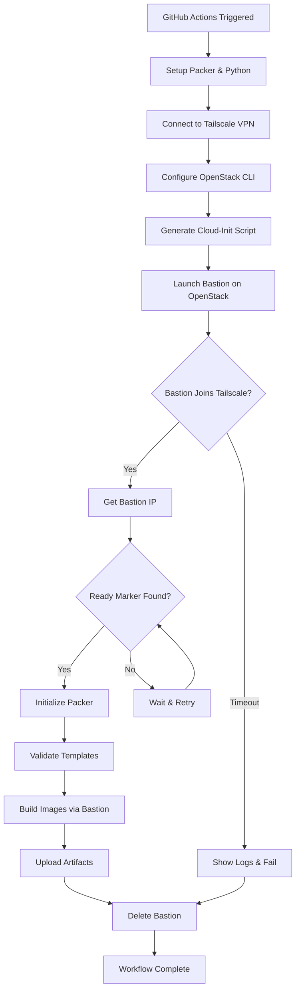

<!--
SPDX-License-Identifier: Apache-2.0
SPDX-FileCopyrightText: 2025 The Linux Foundation
-->

# OpenStack Bastion with Tailscale Action

A GitHub Action to setup and teardown OpenStack bastion hosts with Tailscale VPN for secure remote access. This action creates ephemeral bastion hosts that connect to your Tailscale network, enabling secure SSH access to OpenStack instances from GitHub Actions runners.

## Features

-   🔒 **Secure Access**: Uses Tailscale VPN for encrypted, zero-trust networking
-   ☁️ **Cloud-Native**: Built for OpenStack cloud environments
-   ⚡ **Ephemeral**: Automatic bastion creation and cleanup
-   🛡️ **Fail-Safe**: Automatic cleanup on timeout or failure
-   🔑 **Flexible Auth**: Supports both OAuth (recommended) and legacy auth keys
-   📊 **Detailed Logging**: Comprehensive logs for debugging

## Architecture

### Component Diagram

```
┌─────────────────────────────────────────────────────────────────┐
│                     GitHub Actions Runner                        │
│  ┌──────────────┐         ┌────────────────┐                   │
│  │   Packer     │────────▶│  Tailscale VPN │                   │
│  │  Installed   │         │   Connected    │                   │
│  └──────────────┘         └────────┬───────┘                   │
└────────────────────────────────────┼─────────────────────────────┘
                                     │
                         Tailscale Mesh Network
                                     │
┌────────────────────────────────────┼─────────────────────────────┐
│                OpenStack Cloud      │                              │
│  ┌─────────────────────────────────▼──────────────────────────┐ │
│  │            Bastion Host (Ephemeral)                         │ │
│  │  ┌──────────────┐    ┌────────────────┐                   │ │
│  │  │  Tailscale   │    │     Packer     │                   │ │
│  │  │   Agent      │    │   (Optional)   │                   │ │
│  │  └──────────────┘    └────────────────┘                   │ │
│  │                                                             │ │
│  │  Cloud-init: Tailscale + Packer + Network Config          │ │
│  └─────────────────────────────────────────────────────────────┘ │
│                              │                                   │
│                              ▼                                   │
│           ┌──────────────────────────────────┐                  │
│           │  OpenStack Resources             │                  │
│           │  (Build Target Infrastructure)    │                  │
│           └──────────────────────────────────┘                  │
└─────────────────────────────────────────────────────────────────┘
```

### Workflow



**Key Stages**:

1. **GitHub Runner Setup** → Install dependencies & connect to Tailscale
2. **Bastion Launch** → Spin up ephemeral VM on OpenStack with cloud-init
3. **Network Mesh** → Bastion joins Tailscale, creates secure tunnel
4. **Build Execution** → Execute builds via bastion proxy
5. **Cleanup** → Destroy bastion, disconnect from Tailscale

See [ARCHITECTURE.md](docs/ARCHITECTURE.md) for detailed architecture documentation.

## Prerequisites

-   OpenStack cloud account with necessary permissions
-   Tailscale account with configured ACLs
-   GitHub repository secrets configured (see Configuration section)

## Usage

### Basic Setup and Teardown

```yaml
jobs:
    my-job:
        runs-on: ubuntu-latest
        steps:
            # Setup bastion
            - name: Setup bastion
              id: bastion
              uses: lfreleng-actions/openstack-bastion-action@v1
              with:
                  operation: setup
                  openstack_auth_url: ${{ secrets.OPENSTACK_AUTH_URL }}
                  openstack_project_id: ${{ secrets.OPENSTACK_PROJECT_ID }}
                  openstack_username: ${{ secrets.OPENSTACK_USERNAME }}
                  openstack_password: ${{ secrets.OPENSTACK_PASSWORD }}
                  tailscale_oauth_client_id: ${{ secrets.TAILSCALE_OAUTH_CLIENT_ID }}
                  tailscale_oauth_secret: ${{ secrets.TAILSCALE_OAUTH_SECRET }}

            # Use bastion
            - name: Use bastion for remote operations
              run: |
                  echo "Bastion IP: ${{ steps.bastion.outputs.bastion_ip }}"
                  # Your operations here

            # Always cleanup
            - name: Cleanup bastion
              if: always()
              uses: lfreleng-actions/openstack-bastion-action@v1
              with:
                  operation: teardown
                  bastion_name: ${{ steps.bastion.outputs.bastion_name }}
                  openstack_auth_url: ${{ secrets.OPENSTACK_AUTH_URL }}
                  openstack_project_id: ${{ secrets.OPENSTACK_PROJECT_ID }}
                  openstack_username: ${{ secrets.OPENSTACK_USERNAME }}
                  openstack_password: ${{ secrets.OPENSTACK_PASSWORD }}
```

### With Custom Configuration

```yaml
- name: Setup bastion with custom settings
  uses: lfreleng-actions/openstack-bastion-action@v1
  with:
      operation: setup
      bastion_flavor: v3-standard-4
      bastion_image: "Ubuntu 24.04 LTS"
      bastion_network: custom-network
      bastion_wait_timeout: 600
      tailscale_tags: tag:ci,tag:bastion
      debug_mode: true
      # ... OpenStack credentials
```

## Inputs

### Required Inputs

| Input                  | Description                                  |
| ---------------------- | -------------------------------------------- |
| `operation`            | Operation to perform: `setup` or `teardown`  |
| `openstack_auth_url`   | OpenStack authentication URL                 |
| `openstack_project_id` | OpenStack project/tenant ID                  |
| `openstack_username`   | OpenStack username                           |
| `openstack_password`   | OpenStack password (base64 encoded or plain) |

### Tailscale Authentication (for setup operation)

**Option 1: OAuth with Ephemeral Keys (Recommended)**

The recommended approach uses OAuth to generate short-lived, ephemeral auth keys for the bastion host:

| Input                          | Description                                          |
| ------------------------------ | ---------------------------------------------------- |
| `tailscale_oauth_client_id`    | Tailscale OAuth client ID                            |
| `tailscale_oauth_secret`       | Tailscale OAuth client secret                        |
| `tailscale_use_ephemeral_keys` | Generate ephemeral keys from OAuth (default: `true`) |

**How it works:**

1. GitHub runner connects to Tailscale using OAuth credentials
2. Action generates a short-lived (1 hour), ephemeral auth key via Tailscale API
3. Ephemeral key is injected into bastion cloud-init for secure, one-time use
4. Bastion automatically removed from Tailscale when destroyed

**Benefits:**

-   ✅ No static auth keys to manage or rotate
-   ✅ Automatic cleanup of bastion devices from Tailscale
-   ✅ Short-lived credentials (1 hour expiry)
-   ✅ Ephemeral devices don't persist in your tailnet
-   ✅ Follows Tailscale security best practices

**Option 2: Direct OAuth (GitHub Runner Only)**

OAuth can be used directly for the GitHub runner, but requires a static auth key for the bastion:

| Input                          | Description                                        |
| ------------------------------ | -------------------------------------------------- |
| `tailscale_oauth_client_id`    | Tailscale OAuth client ID (for runner)             |
| `tailscale_oauth_secret`       | Tailscale OAuth client secret (for runner)         |
| `tailscale_auth_key`           | Static auth key for bastion host                   |
| `tailscale_use_ephemeral_keys` | Set to `false` to disable ephemeral key generation |

**Option 3: Auth Key Only (Legacy)**

Both runner and bastion use the same static auth key:

| Input                | Description                                                |
| -------------------- | ---------------------------------------------------------- |
| `tailscale_auth_key` | Tailscale authentication key (for both runner and bastion) |

**⚠️ Not recommended:** Requires managing static auth keys and manual device cleanup.

### Optional Inputs

| Input                  | Description            | Default                                    |
| ---------------------- | ---------------------- | ------------------------------------------ |
| `openstack_region`     | OpenStack region       | `ca-ymq-1`                                 |
| `openstack_network_id` | OpenStack network UUID | ``                                         |
| `bastion_flavor`       | Instance flavor        | `v3-standard-2`                            |
| `bastion_image`        | Base image name        | `Ubuntu 22.04.5 LTS (x86_64) [2025-03-27]` |
| `bastion_network`      | Network name           | `odlci`                                    |
| `bastion_ssh_key`      | SSH key name           | ``                                         |
| `bastion_wait_timeout` | Timeout in seconds     | `300`                                      |
| `bastion_name`         | Custom bastion name    | `bastion-gh-{run_id}`                      |
| `tailscale_tags`       | Tailscale tags         | `tag:ci`                                   |
| `tailscale_version`    | Tailscale version      | `latest`                                   |
| `debug_mode`           | Enable debug logging   | `false`                                    |

## Outputs

| Output         | Description                               |
| -------------- | ----------------------------------------- |
| `bastion_ip`   | Tailscale IP address of the bastion host  |
| `bastion_name` | Name of the bastion instance              |
| `status`       | Operation status (`success` or `failure`) |

## Configuration

### GitHub Secrets

Configure these secrets in your GitHub repository:

#### Required Secrets

-   `OPENSTACK_AUTH_URL`: OpenStack authentication endpoint
-   `OPENSTACK_PROJECT_ID`: OpenStack project/tenant ID
-   `OPENSTACK_USERNAME`: OpenStack username
-   `OPENSTACK_PASSWORD` or `OPENSTACK_PASSWORD_B64`: OpenStack password (plain or base64 encoded)

#### Tailscale Secrets (choose one method)

**OAuth Method (Recommended)**

-   `TAILSCALE_OAUTH_CLIENT_ID`: OAuth client ID
-   `TAILSCALE_OAUTH_SECRET`: OAuth client secret

**Auth Key Method (Legacy)**

-   `TAILSCALE_AUTH_KEY`: Authentication key

### Tailscale ACL Configuration

Your Tailscale ACL must include:

```json
{
    "tagOwners": {
        "tag:ci": ["autogroup:admin", "autogroup:owner", "tag:ci"],
        "tag:bastion": [
            "autogroup:admin",
            "autogroup:owner",
            "tag:ci",
            "tag:bastion"
        ]
    },
    "acls": [
        {
            "action": "accept",
            "src": ["autogroup:admin", "tag:ci", "tag:bastion"],
            "dst": ["*:*"]
        }
    ],
    "grants": [
        {
            "src": ["*"],
            "dst": ["*"],
            "ip": ["*"]
        }
    ],
    "ssh": [
        {
            "action": "accept",
            "src": ["autogroup:member", "tag:ci"],
            "dst": ["tag:bastion"],
            "users": ["root", "ubuntu", "autogroup:nonroot"]
        }
    ],
    "autoApprovers": {
        "routes": {
            "0.0.0.0/0": ["autogroup:admin"],
            "::/0": ["autogroup:admin"]
        },
        "exitNode": ["autogroup:admin"]
    }
}
```

See [Tailscale Setup Guide](docs/TAILSCALE_SETUP.md) for detailed configuration.

## How It Works

1. **Setup Operation**:

    - Connects GitHub Actions runner to Tailscale network
    - Creates cloud-init configuration with Tailscale setup
    - Launches OpenStack instance with cloud-init
    - Waits for bastion to join Tailscale network
    - Returns bastion Tailscale IP for secure access
    - Automatic cleanup if setup times out

2. **Teardown Operation**:
    - Deletes the OpenStack bastion instance
    - Verifies successful deletion

## Examples

See the [examples/workflows](examples/workflows/) directory for complete workflow examples.

## Development

See [DEVELOPMENT.md](docs/DEVELOPMENT.md) for development and testing guidelines.

## License

Apache License 2.0 - See [LICENSE](LICENSE) for details.

## Testing

This action includes comprehensive test workflows to validate functionality:

### Test Workflows

1. **test-bastion-setup.yaml** - Complete lifecycle test

    - Tests bastion setup with OAuth authentication
    - Validates connectivity and SSH access
    - Tests network connectivity from bastion
    - Verifies proper teardown and cleanup
    - Run manually via workflow_dispatch or automatically on push/PR

2. **test-authkey.yaml** - Legacy authentication test

    - Tests bastion setup with legacy auth keys
    - Validates backward compatibility
    - Run manually via workflow_dispatch

3. **test-error-handling.yaml** - Error scenario tests
    - Tests timeout behavior and auto-cleanup
    - Tests invalid credentials handling
    - Tests missing Tailscale authentication
    - Run manually via workflow_dispatch with scenario selection

### Running Tests Locally

To run tests manually:

```bash
# Run complete setup/teardown test
gh workflow run test-bastion-setup.yaml

# Run auth key compatibility test
gh workflow run test-authkey.yaml

# Run error handling tests
gh workflow run test-error-handling.yaml -f test_scenario=timeout
gh workflow run test-error-handling.yaml -f test_scenario=invalid_credentials
gh workflow run test-error-handling.yaml -f test_scenario=network_error
```

### Test Coverage

The test suite validates:

-   ✅ Bastion host creation and initialization
-   ✅ Tailscale network connectivity (OAuth and auth key methods)
-   ✅ SSH connectivity and command execution
-   ✅ Network connectivity from bastion
-   ✅ Proper cleanup and resource deletion
-   ✅ Timeout handling and auto-cleanup
-   ✅ Error handling for invalid credentials
-   ✅ Graceful failure scenarios

## Support

For issues, questions, or contributions, please open an issue in the repository.
