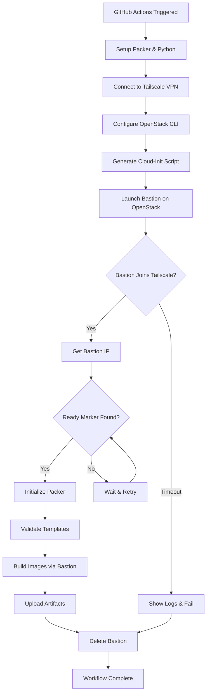

# OpenStack Tailscale Bastion MVP - Complete Setup Guide

## Architecture Overview

```
┌─────────────────────────────────────────────────────────────────┐
│                     GitHub Actions Runner                        │
│  ┌──────────────┐         ┌────────────────┐                   │
│  │   Packer     │────────▶│  Tailscale VPN │                   │
│  │  Installed   │         │   Connected    │                   │
│  └──────────────┘         └────────┬───────┘                   │
└────────────────────────────────────┼─────────────────────────────┘
                                     │
                         Tailscale Mesh Network
                                     │
┌────────────────────────────────────┼─────────────────────────────┐
│                OpenStack Cloud      │                              │
│  ┌─────────────────────────────────▼──────────────────────────┐ │
│  │            Bastion Host (Ephemeral)                         │ │
│  │  ┌──────────────┐    ┌────────────────┐                   │ │
│  │  │  Tailscale   │    │     Packer     │                   │ │
│  │  │   Agent      │    │   (Optional)   │                   │ │
│  │  └──────────────┘    └────────────────┘                   │ │
│  │                                                             │ │
│  │  Cloud-init: Tailscale + Packer + Network Config          │ │
│  └─────────────────────────────────────────────────────────────┘ │
│                              │                                   │
│                              ▼                                   │
│           ┌──────────────────────────────────┐                  │
│           │  OpenStack OpenStack Resources     │                  │
│           │  (Build Target Infrastructure)    │                  │
│           └──────────────────────────────────┘                  │
└─────────────────────────────────────────────────────────────────┘
```

## Workflow Stages

1. **GitHub Runner Setup** → Install Packer & Tailscale
2. **Bastion Launch** → Spin up VM on OpenStack with cloud-init
3. **Network Mesh** → Bastion joins Tailscale, creates secure tunnel
4. **Packer Build** → Execute builds via bastion or through bastion proxy
5. **Cleanup** → Destroy bastion, disconnect from Tailscale

---

## Required GitHub Secrets

Configure these in your repository: **Settings → Secrets and variables → Actions**

### Tailscale Secrets

| Secret Name                                              | Description                    | How to Get                                                                                                           |
| -------------------------------------------------------- | ------------------------------ | -------------------------------------------------------------------------------------------------------------------- |
| `TAILSCALE_OAUTH_CLIENT_ID` and `TAILSCALE_OAUTH_SECRET` | OAuth client for GitHub runner | [Tailscale Admin Console](https://login.tailscale.com/admin/settings/oauth) → Generate OAuth client                  |
| `TAILSCALE_AUTH_KEY`                                     | Auth key for bastion host      | [Tailscale Admin Console](https://login.tailscale.com/admin/settings/keys) → Generate auth key (ephemeral, reusable) |

**Tailscale OAuth Key Settings:**

-   **Devices:** Write access
-   **Ephemeral:** Recommended (auto-cleanup)
-   **Tags:** `tag:ci` for GitHub runner, `tag:bastion` for bastion host

**Tailscale Auth Key Settings:**

-   ✅ Ephemeral (bastion auto-removed after disconnect)
-   ✅ Reusable (multiple workflow runs)
-   ✅ Pre-approved (no manual approval needed)
-   Tags: `tag:bastion`

### OpenStack OpenStack Secrets

| Secret Name              | Description             | Where to Find                          |
| ------------------------ | ----------------------- | -------------------------------------- |
| `OPENSTACK_AUTH_URL`     | OpenStack auth endpoint | OpenStack dashboard → API Access       |
| `OPENSTACK_PROJECT_ID`   | Project/tenant ID       | OpenStack dashboard → Project settings |
| `OPENSTACK_PROJECT_NAME` | Project name            | OpenStack dashboard → Project settings |
| `OPENSTACK_USERNAME`     | OpenStack username      | Your OpenStack credentials             |
| `OPENSTACK_PASSWORD`     | OpenStack password      | Your OpenStack credentials             |
| `OPENSTACK_REGION`       | Region name             | OpenStack dashboard (e.g., `ca-ymq-1`) |

**Example Values:**

```bash
OPENSTACK_AUTH_URL=https://auth.openstack.net/v3
OPENSTACK_PROJECT_ID=abc123def456...
OPENSTACK_PROJECT_NAME=my-project
OPENSTACK_USERNAME=user@example.com
OPENSTACK_PASSWORD=secure_password_here
OPENSTACK_REGION=ca-ymq-1
```

---

## Repository Structure

```
packer-jobs/
├── .github/
│   └── workflows/
│       └── packer-openstack-bastion-build.yaml  # Main workflow file
├── common-packer/                               # Packer files (optional submodule)
│   ├── variables.pkrvars.hcl                   # Packer variables
│   ├── ubuntu.pkr.hcl                          # Packer template
│   └── scripts/                                 # Provisioning scripts
├── templates/
│   └── bastion-cloud-init.yaml                 # Bastion cloud-init template
├── examples/                                    # Example Packer configurations
│   ├── templates/
│   │   └── builder.pkr.hcl                     # Example template
│   ├── vars/
│   │   └── ubuntu-22.04.pkrvars.hcl           # Example variables
│   └── provision/
│       └── baseline.sh                         # Example provisioning
├── docs/
│   ├── QUICK_START.md                          # Getting started guide
│   ├── TROUBLESHOOTING.md                      # Problem solving
│   ├── BASTION_CLOUD_INIT.md                  # Cloud-init reference
│   └── ARCHITECTURE.md                         # This file
├── .pre-commit-config.yaml                     # Code quality hooks
├── .yamllint.conf                              # YAML linting rules
├── .gitignore                                  # Git exclusions
├── README.md                                   # Project overview
├── CHECKLIST.md                                # Setup verification
├── setup.sh                                    # Interactive setup
└── test-templates.sh                           # Template validation
```

---

## Cloud-Init Script Details

### What the Cloud-Init Does

1. **System Setup**

    - Updates packages
    - Installs required tools (curl, wget, jq, network tools)
    - Enables IP forwarding for network routing

2. **Tailscale Installation**

    - Downloads and installs Tailscale
    - Authenticates with auth key
    - Joins Tailscale network with `tag:bastion`
    - Enables Tailscale SSH for secure access

3. **Packer Installation** (Optional)

    - Can be enabled in cloud-init
    - Adds HashiCorp repository
    - Installs latest Packer version
    - Ready for builds if running Packer on bastion

4. **Status Indicator**
    - Creates `/tmp/bastion-ready` file
    - Logs completion to `/var/log/bastion-init.log`
    - Displays status in console

### Cloud-Init Configuration Options

See `templates/bastion-cloud-init.yaml` for the full configuration.

**Minimal cloud-init (faster boot):**

```yaml
#cloud-config
package_update: true
packages: [curl]
runcmd:
    - curl -fsSL https://tailscale.com/install.sh | sh
    - tailscale up --authkey="${TAILSCALE_AUTH_KEY}" --hostname="bastion-$RUN_ID" --ssh
```

**Full cloud-init (includes comprehensive setup):**

-   See `templates/bastion-cloud-init.yaml`
-   Includes network configuration, logging, ready markers
-   Used by default in workflow

---

## Packer Configuration for Bastion

### Option A: Run Packer Locally (via Bastion Proxy)

Use bastion as SSH jump host:

```hcl
# ubuntu.pkr.hcl
variable "bastion_host" {
  type    = string
  default = ""
  description = "Bastion host IP (from Tailscale)"
}

variable "bastion_user" {
  type    = string
  default = "root"
  description = "Bastion SSH user"
}

source "openstack" "ubuntu" {
  # OpenStack OpenStack config
  identity_endpoint = env("OS_AUTH_URL")
  username         = env("OS_USERNAME")
  password         = env("OS_PASSWORD")
  tenant_name      = env("OS_PROJECT_NAME")
  region           = env("OS_REGION_NAME")

  # Use bastion as SSH proxy
  ssh_bastion_host     = var.bastion_host != "" ? var.bastion_host : null
  ssh_bastion_username = var.bastion_user

  # Instance config
  image_name       = "my-custom-image"
  source_image_name = "Ubuntu 22.04"
  flavor           = "v3-standard-2"
  networks         = ["default"]

  # SSH config
  ssh_username = "ubuntu"
  ssh_timeout  = "30m"
}

build {
  sources = ["source.openstack.ubuntu"]

  provisioner "shell" {
    inline = [
      "echo 'Building via bastion at ${var.bastion_host}'",
      "sudo apt-get update",
      "sudo apt-get upgrade -y"
    ]
  }
}
```

### Option B: Run Packer on Bastion

Copy files to bastion and execute there:

```yaml
- name: Run Packer on bastion
  run: |
      # Copy Packer files to bastion
      scp -r ./common-packer/ root@${BASTION_IP}:/root/build/

      # Copy cloud credentials
      ssh root@${BASTION_IP} << 'ENDSSH'
        export OS_AUTH_URL="${{ secrets.OPENSTACK_AUTH_URL }}"
        export OS_USERNAME="${{ secrets.OPENSTACK_USERNAME }}"
        export OS_PASSWORD="${{ secrets.OPENSTACK_PASSWORD }}"
        export OS_PROJECT_NAME="${{ secrets.OPENSTACK_PROJECT_NAME }}"
        export OS_REGION_NAME="${{ secrets.OPENSTACK_REGION }}"

        cd /root/build/common-packer
        packer build .
      ENDSSH
```

---

## Customization Options

### 1. Change Instance Flavor

```yaml
# In workflow dispatch inputs
bastion_flavor: "v3-starter-2" # Smaller for testing

# Or in workflow env
env:
    OPENSTACK_FLAVOR: "v3-standard-4" # Larger for heavy builds
```

Available flavors:

-   `v3-starter-1` - 1 vCPU, 2GB RAM (smallest)
-   `v3-starter-2` - 1 vCPU, 4GB RAM
-   `v3-standard-2` - 2 vCPU, 8GB RAM (recommended)
-   `v3-standard-4` - 4 vCPU, 16GB RAM
-   `v3-standard-8` - 8 vCPU, 32GB RAM

### 2. Use Different Base Image

```yaml
bastion_image: "Debian 12"       # Alternative distro
# or
bastion_image: "Rocky Linux 9"   # RHEL-based
# or
bastion_image: "Ubuntu 24.04"    # Latest Ubuntu
```

### 3. Add Security Group

```yaml
- name: Launch bastion
  run: |
      openstack server create \
        --security-group allow-tailscale \
        --security-group allow-ssh \
        --flavor "${{ env.OPENSTACK_FLAVOR }}" \
        --image "${{ env.OPENSTACK_IMAGE }}" \
        --network "${{ env.OPENSTACK_NETWORK }}" \
        --user-data cloud-init.yaml \
        "${{ env.BASTION_NAME }}"
```

### 4. Persistent Bastion (Dev/Testing)

Keep bastion running for development:

```yaml
# In Tailscale auth key settings:
# - Uncheck "Ephemeral"
# - Check "Reusable"

# In workflow, disable cleanup:
- name: Cleanup bastion instance
  if: false # Disable cleanup for testing
  run: |
      openstack server delete "${{ env.BASTION_NAME }}"
```

---

## Troubleshooting

### Bastion Not Appearing in Tailscale

**Check cloud-init logs via OpenStack console:**

```bash
openstack console log show bastion-gh-12345 --lines 100
```

**SSH to bastion via OpenStack console and check:**

```bash
# Cloud-init status
sudo cloud-init status --wait
sudo tail -f /var/log/cloud-init-output.log

# Bastion init log
cat /var/log/bastion-init.log

# Tailscale status
sudo tailscale status
sudo journalctl -u tailscaled
```

**Common issues:**

-   Auth key expired → Generate new key
-   Network blocked → Check OpenStack security groups
-   Cloud-init failed → Check `/var/log/cloud-init.log`
-   Tailscale install failed → Check network connectivity

### OpenStack Connection Failed

**Test OpenStack credentials locally:**

```bash
export OS_AUTH_URL="https://auth.openstack.net/v3"
export OS_USERNAME="your-username"
export OS_PASSWORD="your-password"
export OS_PROJECT_NAME="your-project"
export OS_REGION_NAME="ca-ymq-1"
export OS_IDENTITY_API_VERSION=3
export OS_USER_DOMAIN_NAME="Default"
export OS_PROJECT_DOMAIN_NAME="Default"

openstack server list
openstack flavor list
openstack image list
```

### Packer Build Fails

**Debug steps:**

1. Enable Packer debug mode:

    ```yaml
    env:
        PACKER_LOG: 1
    ```

2. Test SSH to target from bastion:

    ```bash
    ssh root@${BASTION_IP}
    # Then from bastion:
    ssh -o StrictHostKeyChecking=no ubuntu@<target-instance-ip>
    ```

3. Check network connectivity:

    ```bash
    ssh root@${BASTION_IP} "ping -c 3 8.8.8.8"
    ssh root@${BASTION_IP} "curl -I https://cloud-images.ubuntu.com"
    ```

4. Verify bastion can reach OpenStack API:
    ```bash
    ssh root@${BASTION_IP} "curl -I https://auth.openstack.net"
    ```

### Workflow Timeout

**Increase global timeout:**

```yaml
jobs:
    packer-build-openstack:
        timeout-minutes: 90 # Increase from default
```

**Add timeouts to specific steps:**

```yaml
- name: Wait for bastion
  timeout-minutes: 10
  run: |
      # wait commands
```

---

## Cost Optimization

### 1. Use Smaller Flavor for Bastion

```yaml
OPENSTACK_FLAVOR: "v3-starter-1" # $0.01/hour vs $0.08/hour
```

### 2. Enable Ephemeral Tailscale Devices

-   Auto-cleanup after disconnect
-   No manual device management
-   Recommended for CI/CD

### 3. Cleanup on Failure

```yaml
- name: Cleanup
  if: always() # Ensures cleanup even on failure
```

### 4. Reuse Bastion for Multiple Builds

```yaml
strategy:
    matrix:
        os: [ubuntu-22, ubuntu-24, debian-12]
# Single bastion serves all matrix builds
```

### 5. Scheduled Cleanup Job

```yaml
# Separate workflow to clean orphaned bastions
on:
    schedule:
        - cron: "0 * * * *" # Hourly cleanup
```

---

## Security Best Practices

✅ **Use ephemeral auth keys** - Auto-expire after use
✅ **Tag-based ACLs** - Restrict access in Tailscale ACL:

```json
{
    "tagOwners": {
        "tag:ci": ["autogroup:admin"],
        "tag:bastion": ["tag:ci"]
    },
    "acls": [
        {
            "action": "accept",
            "src": ["tag:ci"],
            "dst": ["tag:bastion:*"]
        },
        {
            "action": "accept",
            "src": ["tag:bastion"],
            "dst": ["*:*"]
        }
    ]
}
```

✅ **Rotate credentials** - Regularly update OpenStack passwords
✅ **Use GitHub environments** - Require approval for production:

```yaml
jobs:
    packer-build-openstack:
        environment: production # Requires approval
```

✅ **Enable audit logging** - Track all Tailscale connections
✅ **Limit secret scope** - Use environment-specific secrets
✅ **Monitor builds** - Set up alerts for failures

---

## Monitoring & Observability

### GitHub Actions

-   **Real-time logs:** Watch builds progress
-   **Artifact downloads:** Packer logs, bastion diagnostics
-   **Email notifications:** Build failures
-   **Status badges:** Display in README

### Tailscale Admin Console

-   **Device connections:** See bastion appear/disappear
-   **Activity logs:** Track all VPN connections
-   **Network stats:** Bandwidth usage
-   **ACL violations:** Security alerts

### OpenStack Dashboard

-   **Instance status:** Monitor bastion lifecycle
-   **Resource usage:** CPU, RAM, disk, network
-   **Billing:** Track costs per build
-   **Quotas:** Monitor usage limits

---

## Advanced: Parallel Builds

Run multiple Packer builds simultaneously with dedicated bastions:

```yaml
strategy:
    fail-fast: false
    matrix:
        os:
            - name: ubuntu-22
              image: "Ubuntu 22.04"
            - name: ubuntu-24
              image: "Ubuntu 24.04"
            - name: debian-12
              image: "Debian 12"

env:
    BASTION_NAME: "gh-bastion-${{ matrix.os.name }}-${{ github.run_id }}"
    OPENSTACK_IMAGE: ${{ matrix.os.image }}
```

Each matrix job gets its own ephemeral bastion!

**Benefits:**

-   Parallel execution (faster total time)
-   Isolated environments
-   Independent cleanup
-   Matrix-specific configurations

---

## Next Steps

1. ✅ **Set up secrets** in GitHub repository
2. ✅ **Review templates** in `templates/` and `examples/`
3. ✅ **Test cloud-init** locally with OpenStack CLI
4. ✅ **Run workflow** with `workflow_dispatch` first
5. ✅ **Monitor logs** in GitHub Actions and Tailscale admin
6. ✅ **Optimize** timing and resource usage
7. ✅ **Scale** to multiple parallel builds if needed
8. ✅ **Automate** with push/schedule triggers

---

## Support & Resources

-   **Tailscale Docs:** https://tailscale.com/kb/
-   **OpenStack Docs:** https://docs.openstack.com/
-   **Packer Docs:** https://developer.hashicorp.com/packer/docs
-   **OpenStack CLI:** https://docs.openstack.org/python-openstackclient/
-   **GitHub Actions:** https://docs.github.com/en/actions
-   **Cloud-Init:** https://cloudinit.readthedocs.io/

### Project Documentation

-   **Quick Start:** `docs/QUICK_START.md`
-   **Troubleshooting:** `docs/TROUBLESHOOTING.md`
-   **Cloud-Init Reference:** `docs/BASTION_CLOUD_INIT.md`
-   **Setup Checklist:** `CHECKLIST.md`

### Community Support

-   **GitHub Discussions:** Ask questions in this repository
-   **Tailscale Community:** https://forum.tailscale.com/
-   **OpenStack Support:** https://openstack.com/support/
-   **Packer Community:** https://discuss.hashicorp.com/c/packer/

---

## Workflow Diagram



---

**Version:** 1.0.0
**Last Updated:** 2025
**License:** Apache-2.0
